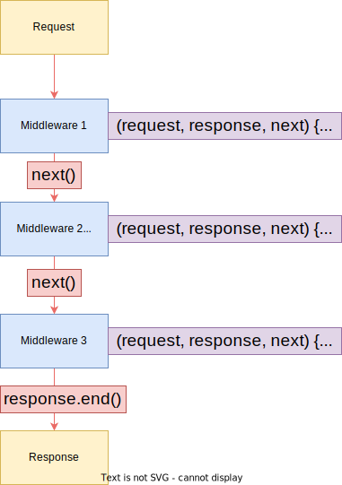

### Intro

- Although your business logic and the project maybe different, but the standard operations like handling incoming requests, routing...etc are same basic things you do in any Node JS project.
- So, Express JS is one such framework (bunch of tools) to help you handle the nitty-gritty details easily and give you more time to focus on business logic.
- To install Express JS, we can use the below npm command in your local project directory.

```
npm install express --save
```

- And to import it in your app.js, you can do it by using **require()** function.

```
const express = require("express");
const app = express();
```

- In the above code, we are are using the imported module as a function. Because in the source code of Express JS, we can see that the whole functionality is exported is a function. Which can be imported and used in any code.
- And the function **express()** in the above code is a valid handler and it can be passed as an argument to **createServer()** function.

```
const http = require("http");
const express = require("express");

const app = express();

const server = http.createServer(app);
server.listen(3000);
```

- If you run **npm start**, then if you open the browser, then it displays the following.

```
Cannot GET /
```

- As we are not handling anything.

### Middleware

- The Express JS is all about middle ware. i.e An incoming request is automatically funneled by a set of functions by Express JS. So instead of having just a single request and response handler, you can have multiple functions and each of them being a request response handler. And we can use one or more of them before finally sending a response to the incoming request.
- In this way we have the flexibility to split the code and our logic into multiple blocks or pieces.
- And this is the nature of the Express JS, one of these middle ware functions can be a third party plugins or packages which can simply plug into Express JS and add a specific functionality. And we can have multiple middle ware functions.



- And in order to build a middle ware function we would usthe **express().use()** method.
- It gives us the flexibility to send a list of request handlers as an argument.
- But for the simple use case, we can use it like below.

```
const http = require("http");
const express = require("express");

const app = express();

app.use((request, response, next) => {
console.log("Into the funnel!.");
});

const server = http.createServer(app);
server.listen(3000);
```

- And if you run the above code using **npm start** and go to **http://localhost:3000**, the page will be loading infinitely, without displaying anything. But in the console you can view the message "Into the funnel!".
- And let us say we use another use method.

```
const http = require("http");
const express = require("express");

const app = express();

app.use((request, response, next) => {
console.log("Into the funnel!.");
});

app.use((request, response, next) => {
console.log("Here comes second middleware.");
});

const server = http.createServer(app);
server.listen(3000);
```

- Now once we execute the above code, we only see the output "Into the funnel!", but not the second console.log() statement we have given in the second use() method. This is because, we haven't defined, which function in the funnel to go to.
- So in order for this to work as expected, we need to call the **next()** function.

```
const http = require("http");
const express = require("express");

const app = express();

app.use((request, response, next) => {
console.log("Into the funnel!.");
next();
});

app.use((request, response, next) => {
console.log("Here comes second middleware.");
});

const server = http.createServer(app);
server.listen(3000);
```

- After executing the above code, still the browser does not display anything, but the output of the console will look something like this.

```
$ npm start

> expressjs@1.0.0 start /home/karthik/Documents/Node JS coursework/Chapter 5 : Introduction to Express JS/src/expressJS
> npx nodemon app.js

[nodemon] 2.0.15
[nodemon] to restart at any time, enter `rs`
[nodemon] watching path(s): *.*
[nodemon] watching extensions: js,mjs,json
[nodemon] starting `node app.js`
Into the funnel!.
Here comes second middleware.
```

- Express JS does not send a response by default, we need to send a response back to the client in the last use() method defined.

```
const http = require("http");
const express = require("express");

const app = express();

app.use((request, response, next) => {
console.log("Into the funnel!.");
next();
});

app.use((request, response, next) => {
response.setHeader('Content-type','text/html');
response.write(`<h1>Express JS!, welcomes you!</h1>`);
return response.end();
});

const server = http.createServer(app);
server.listen(3000);
```

- Instead of setting a response content type and creating response body, we can directly use a method called **send()** provided by Express JS, which by default sends content with "text/html" content type.

```
const http = require("http");
const express = require("express");

const app = express();

app.use((request, response, next) => {
console.log("Into the funnel!.");
next();
});

app.use((request, response, next) => {
response.send(`<h1>Express JS, welcomes you</h1>`);
});

const server = http.createServer(app);
server.listen(3000);
```

- Also we can directly call **listen()** method provided by the Express JS and we can skip the hassle of importing http module and calling ceateServer() method.

```
const express = require("express");

const app = express();

app.use((request, response, next) => {
console.log("Into the funnel!.");
next();
});

app.use((request, response, next) => {
response.send(`<h1>Express JS, welcomes you</h1>`);
});

app.listen(3000);
```

### Routing in Express JS

- The use() function has multiple versions, each one with different set of parameters that we can use.
- The use() function has an optional firsts argument **Path**, which can be a string, regexp or array or combinations of strings or regexp, Which indicated for which path the current middle ware function can be invoked,


```
const express = require("express");
const app = express();

app.use("/",(request, response, next) => {
response.send(`<h1>Express JS, welcomes you</h1>`);
});

app.listen(3000);

```

- When you run the above code and open http://localhost:3000 **/**, the beowser displays "Express JS, welcomes you", but you open any random url starting with "/<any_string>" and still you will get the same page displaying "Express JS, welcomes you". So the parameter invokes the middleware function if the path starts with **/**. But all paths start with a **/**. So we need to specifically add the full path.

```
const express = require("express");
const app = express();

app.use("/karthik",(request, response, next) => {
response.send(`<h1>Express JS, welcomes karthik</h1>`);
});

app.use("/",(request, response, next) => {
response.send(`<h1>Express JS, welcomes you</h1>`);
});

app.listen(3000);
```
- The above code displays "Express JS, welcomes karthik" only when the path is **karthik**. And for any other path it displays the same thing as what it displays for **/**.
- If you put the **/** first and **/karthik**, then it does not work as expected and always loads the content sent for root.
- Whenever we are adding a new middleware, we need to add it on the top of existing middlewares and then decide to either go to next middle ware or directly send a response.

### Handling a POST request

- Instead of setting statusCode and then redirecting to a page, Express JS has a **redirect()** function, which does the job.
- Unlike the conventional Node JS, Express JS attaches a **body** parameter directly to the request object which needs to be parsed explicitly using a third party package called **body-parser**.
- Which can be installed using :

```
npm install body-parser --save
```

- And the body parser middleware can be added at the top which parses the request automatically **app.use(bodyParser.urlencoded())**. 

```
...
const bodyParser = require("body-parser");

const app = express();

app.use(bodyParser.urlencoded());

...
```

- Let us say we are not using body-parser, and try to log **request.body**, then we can see that the value will be **undefined**. You can verify that by executing the below code.


```
const express = require("express");


const app = express();


app.use("/product", (request, response, next) => {
    console.log(request.body);
    response.redirect("/");
});

app.use("/add-product",(request, response, next) => {
response.send(`<form action="/product" method="POST"><input type="text" name="product"><button type="sumbit">add product</button></form>`);
});

app.use("/",(request, response, next) => {
response.send(`<h1>Express JS, welcomes you to homepage</h1>`);
});

app.listen(3000);
```

- Now if we add the body parser middleware, the code would look something like this :

```
const express = require("express");
const bodyParser = require("body-parser");

const app = express();

app.use(bodyParser.urlencoded());

app.use("/product", (request, response, next) => {
    console.log(request.body);
    response.redirect("/");
});

app.use("/add-product",(request, response, next) => {
response.send(`<form action="/product" method="POST"><input type="text" name="product"><button type="sumbit">add product</button></form>`);
});

app.use("/",(request, response, next) => {
response.send(`<h1>Express JS, welcomes you to homepage</h1>`);
});

app.listen(3000);
```

- Now let us say, in the add-product page we have given the input "Smart plug", then the console will print the following.

```
{ product: 'Smart plug' }
```
- As you can see from the above output, the body parser has produced an JavaScript object which can be used directly.
- If you are getting a warning **body-parser deprecated undefined extended: provide extended option app.js:6:20**, then you can make the following modifications.

```
...
const bodyParser = require("body-parser");

const app = express();

app.use(bodyParser.urlencoded({
	extended:false
}));

...
```

- Now the problem with the code we have written till now is that : `app.use('/product'...` function will run for both **GET** and as well as for **POST** requests.
- So to avoid this issue, instead of using **app.use()**, we use either **app.get()** or **app.post()**, depending on the situation. Similarly we have these for other http methods **app.patch()**, **app.delete()** and **app.put()**. 

### Routing using Express router

- We can distribute the routing logic over various files. Lets create a new folder called **routes**. Under which we are going to handle diferrent routes, where each route logic is stored in a seperate file.
-  Say, we want to manage the route of admin page, we can create a file called admin.js under routes folder. Similarly we can create other files.
-  app.use() method does not do exact path mathcing, whereas app.get() and app.put() does exact path matching.
-  And admin.js looks something like this which handles /add-product and /product.

```
const express = require('express');

const router = express.Router();

router.post("/product", (request, response, next) => {
    console.log(request.body);
    response.redirect("/");
});

router.get("/add-product",(request, response, next) => {
response.send(`<form action="/product" method="POST"><input type="text" name="product"><button type="sumbit">add product</button></form>`);
});

module.exports = router;
```

- And the app.js would look something like this :

```
const express = require("express");
const bodyParser = require("body-parser");
const admin_routes = require('./routes/admin');


const app = express();

app.use(bodyParser.urlencoded({
    extended :true
}));

app.use(admin_routes);


app.get("/",(request, response, next) => {
response.send(`<h1>Express JS, welcomes you to homepage</h1>`);
});

app.listen(3000);
```
- And in the app.js, the order of the things still matter, if you prefer to use app.use().

### Adding a 404 error page

- If we enter a random string after the / int the browser we would get the below error. `Cannot GET /shope`
- We can all the regular methods of response like : **setHeader()**..etc before using the send() method.
- So we can create a **404 page not found** message by adding the below code at the end of out app.js file.

```
app.use((request,response,next) => {
	response.status(404).send(`<h1>404 : Page not found</h1>`);
});
```
- We can use two differrent middleware for same routes as long as the methods are diferrent.

```
app.get("/add-product",(request,response,next) => {
	//something here
});

app.post("/add-product",(request,response,next) => {
	//something here
});
```
- Let us say we have part of the route that is repeating, we can can actually add it in the app.use() in the app.js directly.
- eg imagine there are two paths /admin/add-product and /admin/shop then we can replace them like this.

```
...
app.use('/admin',admin_routes);
app.use('/admin',shop_routes);
...
```
- **So this filtering mechanism in Express JS will help us a specific path (/admin) and then you can define all the routes(/add-product, /product) within that path in a specific file.** 

### Creating and serving HTML pages

- And you can create HTML pages under a new folder called **views** and then render them instead of sending dummy HTML code.
- You can use the templating engine to dynamically create HTML content.
- So we need to send a file as a response. And fot that we use **response.sendFile()** which by default sets the header conent.

```
response.sendFile('<path to the file>');
```

- We can use the core module **path** to easily handle sending the path to the files.

```
const path = require('path');
```

- Now the **_dirname** contains the path of the project folder. So we can use **path.join()** method to get the path to the files.

```
response.sendFile(path.join(_dirname,'../','views','shop.html'));
```
- And this path module handles all the path accordingly on both linux and as well as windows systems.
- In order to use external css files to style your web pages, you can create a folder called **public** and host all the static files you want to load onto your web page.
- Static files are the ones which are nto handles by the express router or any other middleware. And such files can also be access via direct url on the browser (read-only).
- For this we a built in middleware from the express.

```
app.use(express.static(path.join(_dirname,'public')));
```
- And inside our router functions we can directly use the path as if we are in the public folder.